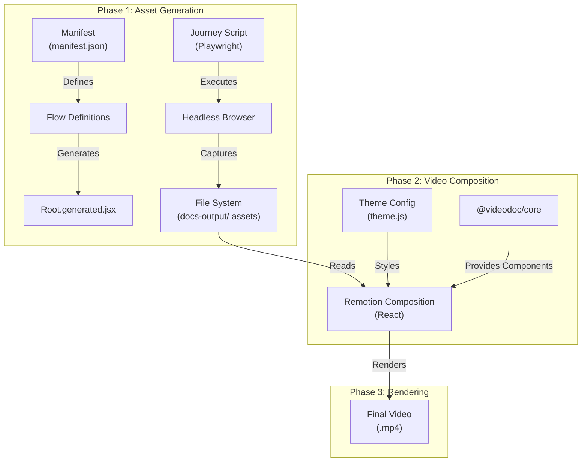
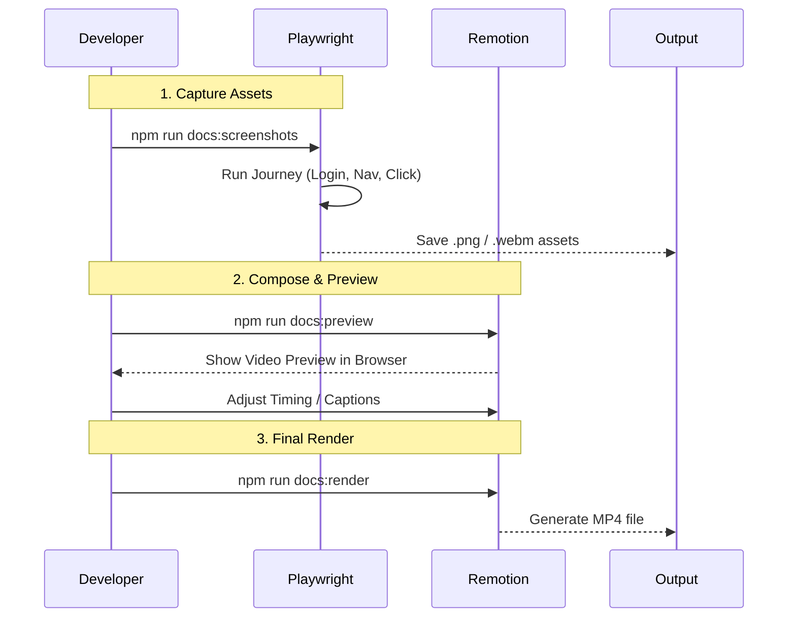

# Codebase Overview

This document provides a comprehensive analysis of the `videodoc` repository from three key perspectives: Software Architect, Software Developer, and Product Manager.

---

## 1. Software Architect Perspective

### System Design
The system is designed as a **pipeline automation toolkit** that bridges End-to-End (E2E) testing tools with programmatic video generation. It decouples the *capture* of visual assets from the *composition* of the final video, allowing for independent scaling and maintenance of both phases.

### Architecture Patterns
- **Monorepo Structure**: The project is organized as a monorepo (managed by npm workspaces), separating the core logic (`@videodoc/core`) from the consumer tools (`create-videodoc`) and the documentation automation implementation itself.
- **Asset Pipeline**:
  1.  **Generation Phase**: Playwright scripts simulate user journeys and generate static assets (screenshots) and short video clips.
  2.  **Voiceover Phase**: The `voiceover-pipeline` extracts captions and uses Google Cloud TTS to generate narration audio, synced to the video steps.
  3.  **Storage Phase**: Assets are stored in a structured directory format (`docs-output/`).
  4.  **Composition Phase**: Remotion (React-based video library) consumes these assets to render frame-accurate videos.
- **Component-Based UI**: The video visual layer is built using reusable React components (`Intro`, `Outro`, `ScreenFrame`), enforcing consistency across different videos.

### Data Flow Diagram

### Scalability & Extensibility
- **Horizontal Scaling**: Journey scripts are independent playbooks. Adding a new documentation video simply requires adding a new pair of Journey Script + Composition.
- **Separation of Concerns**: The testing logic (how to get to a screen) is separated from the presentation logic (how to show that screen in a video).
- **Themeable**: The system uses a centralized theme object (`theme.js`), making it easy to rebrand all generated videos by changing a single file.

---

## 2. Software Developer Perspective

### Code Structure
- **`packages/core`**: The heart of the library.
    - `playwright/`: Helpers for capturing assets (`capture`, `recordClip`).
    - `remotion/`: Base components for video layout (`BaseComposition`).
    - `voiceover/`: Full pipeline for TTS generation (`voiceover-pipeline.js`) and playback hooks (`useVoiceover`).
    - `components/`: UI building blocks (`Intro`, `ScreenFrame`, `Highlight`).
- **`packages/create-videodoc`**: The CLI tool for scaffolding new projects.
- **`docs-automation`**: The reference implementation / user-space folder where the distinct journeys and compositions live.

### Key Implementation Details
- **Capture Logic**: The `capture` function (`packages/core/src/playwright/helpers.js`) handles the complexity of file naming and directory management. `recordClip` allows capturing video segments (webm) for animated interactions.
- **Voiceover Pipeline**: A standalone node script (`voiceover-pipeline.js`) parses React composition files to extract `<Caption>` text, sends it to Google Cloud TTS, and generates an MP3 + sync manifest.
- **Video Composition**: Remotion compositions use `Sequence` to time events. Timings are frame-based (usually 30fps).
- **Developer Experience (DX)**:
    - **Scaffolding**: `npx create-videodoc init` sets up the environment.
    - **Preview**: `npm run docs:preview` allows real-time editing of the video layout without re-running the browser automation.
    - **Hot Reloading**: Editing a composition reflects immediately in the Remotion preview.

### Workflow

### Maintainability
- **Reusable Components**: Common video patterns (zoom, highlight, device frame) are encapsulated in `@videodoc/core`, reducing code duplication in individual compositions.
- **Test-Driven Mental Model**: The "Journey" concept aligns with E2E testing mental models, making it easy for developers already familiar with testing to write documentation.

---

## 3. Product Manager Perspective

### Value Proposition
- **"Living Documentation"**: Documentation videos often become outdated the moment the UI changes. This tool ensures videos are regenerated automatically with the latest UI, keeping docs always up-to-date.
- **Brand Consistency**: By using code to generate videos, every tutorial follows the exact same timing, transition style, and branding (colors/logos), creating a highly professional polish that is hard to achieve manually across a team.

### Feature Analysis
- **Automated Asset Capture**: Removes the tedious work of manually taking screenshots and recording clips.
- **Automated Voiceover**: Generates professional, natural-sounding narration in multiple languages (via Google Cloud TTS) directly from your code's captions. No recording studio needed.
- **Professional Polish**: Includes built-in support for:
    - **Device Frames**: Wraps screenshots in browser or mobile frames.
    - **Highlights**: Automatically draws attention to buttons or inputs.
    - **Zooms**: Smooth camera moves to focus on details.
- **CI/CD Integration**: Can be run in a CI pipeline (e.g., GitHub Actions) to generate new videos on every deployment.

### User Flows (for the Developer/User)
1.  **Setup**: Run `init` command to bootstrap the project.
2.  **Define**: Write a script to "walk" through the app features (Journey).
3.  **Refine**: Write the video script (Composition) connecting the assets.
4.  **Publish**: Render and upload.

---

## 4. Actionable Insights & Recommendations

### For the Architect
- **Schema Validation**: Consider introducing a schema (e.g., Zod) for the `theme.js` and configuration files to prevent runtime errors during rendering.
- **Plugin System**: `packages/core` is currently a monolithic collection of helpers. Breaking it down into `@videodoc/playwright` and `@videodoc/remotion` could improve clarity and reduce bundle size for consumers who only need one part.

### For the Developer
- **Type Safety**: Migrating to TypeScript would significantly improve the developer experience, especially for the `config` objects and component props, preventing issues like missing `theme` properties.
- **Testing**: While the tool *is* for testing/docs, the core logic itself (`capture`, `recordClip`) should have its own unit tests to ensure reliability across Playwright versions.

### For the Product Manager
- **Hosting Integration**: Consider adding a "Publish" step to the CLI to automatically upload rendered videos to a hosting provider (S3, YouTube, Vimeo) and return the embed code.
- **Localization**: Since the voiceover pipeline supports different voices, adding first-class support for multi-language video generation (e.g. `npm run docs:render --lang=es`) would be a next logical step.

